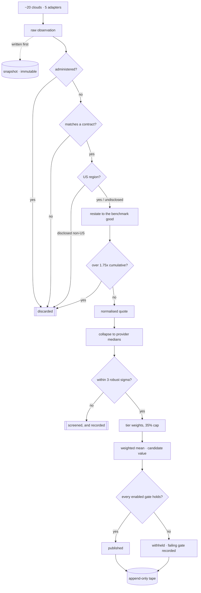
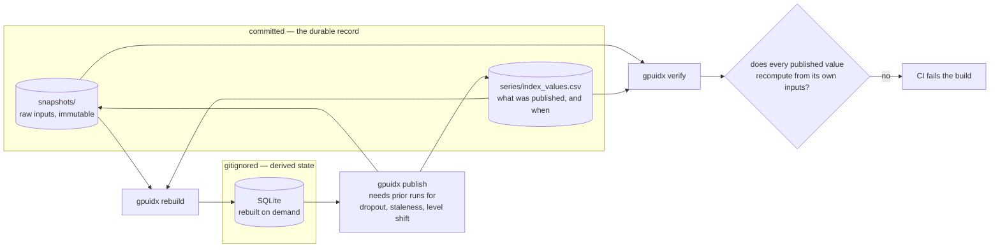

# gpuidx

A working daily GPU rental price benchmark, built from live public pricing
across ~20 clouds, with the governance machinery a settlement-grade index
needs: a waterfall, robust estimation, publication gates, and a bitemporal
audit trail.

Built as a study of what it takes to turn heterogeneous compute pricing into a
number something could settle against. **It is a demonstration. Do not settle
anything against these values.**

The interesting part is not the pipeline — it is [METHODOLOGY.md](METHODOLOGY.md),
particularly section 10.

## Quickstart

```bash
uv sync
uv run gpuidx rebuild     # restore the series from the committed archive
uv run gpuidx show GIX-H100
uv run gpuidx verify      # prove every value reproduces from its own inputs
```

That path needs no network and no credentials — it reads the archive in this
repo. `uv run gpuidx publish` runs a live collection instead, which is what the
daily job does.

Output from the run of 2026-08-27, as that day's fixing stands on the tape:

```
                              daily fixing
+---------------------------------------------------------------------+
| index      |  value | prov | obs |  disp | status                    |
|------------+--------+------+-----+-------+---------------------------|
| GIX-H100   | $3.590 |   12 |  46 | 0.391 | published                 |
| GIX-H200   | $3.599 |    7 |  20 | 0.175 | published                 |
| GIX-A100   |     -- |   10 |  54 | 0.510 | withheld  dispersion      |
| GIX-B200   | $5.938 |    6 |  29 | 0.249 | published                 |
| GIX-MI300X |     -- |    1 |   2 |    -- | withheld  min_providers   |
+---------------------------------------------------------------------+
```

Two of five indices decline to print. That is the system working. Those are
that run's numbers and not today's; the series has run daily since, and the
current fixings are on the
[demo site](https://henryzhangpku.github.io/gpu-price-index/).

## How a price becomes a fixing

Every arrow that leaves the main line is a place an input is thrown away. Most
of the work in a benchmark is deciding what does not count.



| Test | Passes when | Why it exists |
|---|---|---|
| administered | the venue's SKUs do not all sit at one fixed ratio | a price that is a function of another price in the sample is a duplicate, not evidence |
| contract match | the venue's GPU string maps to exactly one benchmark | H100 NVL and H200 are one substring apart; a silent mismatch corrupts two indices |
| region | US, or the venue publishes no region at all | power and tax regimes are not a scalar, so region is screened rather than adjusted |
| 1.75x cap | form factor, fabric, commitment and node size multiply to 1.75 or less | past that the number describes the adjustment schedule rather than the market |
| 3 robust sigma | the provider sits near the cross-provider median | MAD has a 50% breakdown point, so the screen cannot be defeated by the outlier it catches |

Note where `withheld` goes. A refusal to print is written to the tape as a row
like any other, carrying the gate that caused it. A gap in the series is a
fact the record has to carry, not an absence of one.

## Commands

```bash
uv run gpuidx contracts                    # benchmark definitions and gates
uv run gpuidx publish                      # run one collection + fixing cycle
uv run gpuidx show GIX-H100                # the series
uv run gpuidx audit GIX-H100 2026-08-27    # every provider behind one value
uv run gpuidx revisions GIX-H100 2026-08-27
uv run gpuidx as-of GIX-H100 2026-08-27 2026-08-27T20:15:00Z
uv run gpuidx rebuild                      # restore the database from the archive
uv run gpuidx verify                       # recompute every value from its inputs
uv run gpuidx calibrate                    # test the adjustment factors against venue pricing
uv run gpuidx forward --spot 3.05          # what committed-use discounts do and don't imply
uv run gpuidx sensitivity                  # how much of each fixing rests on judgement
uv run gpuidx export-web                   # dump the archive as JSON for the demo site
```

`audit` is the one worth looking at. It shows every contributing provider,
its weight and share, and every provider that was screened out and why.

## Demo site

A two-page static site, published to GitHub Pages by
[a workflow](.github/workflows/pages.yml) that runs when the daily fixing
finishes, and on any push touching `web/` or `src/`.

It has to watch the fixing *workflow* rather than its push: the fixing commits
with the default `GITHUB_TOKEN`, and GitHub does not let a push made with that
token start another workflow. Wiring the deploy to the push alone left the site
a day stale after every fixing — silently, which is the worst way for a page
that claims to follow the tape to be wrong.

* **Method** — what a settlement-grade number requires, and where this one is weak.
* **Dashboard** — the series with its gaps intact, every provider behind every
  fixing, the gate results, and the adjustment applied to each contributing quote.

The site computes nothing. `gpuidx export-web` derives three JSON files from the
snapshots and the tape, recomputing the newest fixing through the same path
`verify` uses, and the pages render them. A withheld index still shows the value
the estimator produced, struck through, next to the gate that stopped it —
hiding it would make withholding look like missing data rather than a decision.

To run it locally:

```bash
uv run gpuidx export-web        # writes web/data/*.json (gitignored)
python -m http.server -d web 8000
```

## The durable record

The pipeline [runs daily](.github/workflows/daily.yml) and commits two things.
The SQLite database is not one of them — it is derived state, rebuilt from the
archive at the start of every run.

```
snapshots/2026-08-27T213543Z.jsonl.gz   every raw observation, exactly as the
                                        venue stated it, never modified
series/index_values.csv                 the publication record: one row per
                                        revision, append-only
```

The snapshots make a value reconstructible. The tape cannot be derived from
them, because it records *what was published and when*, including values later
superseded — re-deriving it from inputs would quietly erase the revision
history, which is the one thing a settlement dispute needs. Each tape row names
the snapshot it came from, so a day carrying two runs can still be checked.

`gpuidx verify` recomputes every published value from its own archived inputs
and fails if any no longer reproduces. It runs in CI on every fixing, which
means the series is not merely logged — it is auditable, and an altered
snapshot or an unversioned methodology change breaks the build.



The loop is the point. The database can be deleted at any moment and rebuilt,
because everything it holds is derived; the two committed artefacts cannot be
derived from anything, which is why they are the ones under version control.

## Sources

All unauthenticated public endpoints. No scraping, no credentials.

| Source | What it gives | Tier |
|---|---|---|
| [Shadeform](https://api.shadeform.ai/v1/instances/types) | ~19 clouds in one feed, with node size, interconnect, NVLink, per-region availability | 1 / 2 |
| [Vast.ai](https://console.vast.ai/api/v0/bundles/) | Marketplace offers with host reliability — the only executable prices here | 1 / 2 |
| [RunPod](https://api.runpod.io/graphql) | Secure and community rate cards on the same hardware | 2 |
| [DataCrunch](https://api.datacrunch.io/v1/instance-types) | On-demand and spot on identical hardware | 2 |
| `data/curated_rate_cards.json` | Hyperscaler list prices, hand-maintained | 3 |

Curated entries carry an `as_of` date, a `source_url`, and a `source_type`
recording how much the number is worth: the AWS rows are read from the feed
backing the EC2 pricing page, the GCP and Azure rows are cross-checked against
third-party aggregators and flagged as lower confidence. Everything here is
dropped after 45 days, so a forgotten catalogue degrades into missing data
rather than into a confidently wrong number.

## Layout

```
src/gpuidx/
  spec.py         benchmark contracts, adjustment factors, gates  <- the methodology
  normalize.py    restate a venue price as the benchmark good
  estimator.py    provider medians, MAD screen, weight caps, gates
  quality.py      stalled feeds, dropout, level shifts
  store.py        bitemporal append-only SQLite
  pipeline.py     the daily cycle, wired end to end
  web.py          export the archive as JSON for the demo site
  providers/      one adapter per venue
web/              the static demo site; reads the export, computes nothing
```

`spec.py` holds every number a dispute would be argued over, in one file, on
purpose.

## What came out of building it

Full write-up in [docs/FINDINGS.md](docs/FINDINGS.md). The short version:

**AWS has repriced into the neocloud range; GCP and Azure have not.** AWS
`p5.48xlarge` works out to $6.88/GPU-hour and survives the outlier screen as a
contributing input. GCP ($10.98) and Azure ($12.29) are screened at 5.8σ and
6.8σ against a neocloud median of $3.25. The hyperscaler tier is not one tier.

I only found this by re-verifying the rate card against source. My first pass
used a remembered AWS figure of $12.29 — launch-era pricing, since cut ~44% —
which produced the tidier but wrong conclusion that hyperscalers are simply a
separate market.

**The A100 market has fragmented, and the gate that detects it flickers.** Ten
providers span $0.81 to $3.50 per GPU-hour — aged hardware dumped on
marketplaces while managed providers keep charging for the service wrapper. But
two runs an hour apart, on a market that did not move, gave dispersion 0.560
(withheld, 10 providers) and 0.365 (published, 9 providers). One mid-range
provider entering flips the publication decision, because MAD over ~10 points
is too coarse an order statistic to gate on. That is a design defect, it only
shows up if you run the thing repeatedly, and fixing it properly needs a real
time series — which is why the pipeline now runs daily.

**A wrong number that gets screened is more dangerous than one that does not.**
With the incorrect AWS figure, AWS was extreme enough to be screened as an
outlier, which tightened the surviving distribution and let A100 publish.
Correcting the input put it inside the screen and stopped publication. The
screen hid the bad input rather than surfacing it. Screening is not a
substitute for verifying inputs at source.

**Half the "market data" here is a pricing policy.** Two venues sell identical
hardware under two commitment types, which should let the commitment
adjustment factors be estimated rather than asserted. RunPod's community-to-
secure ratio ranges 0.31–7.58 across models with a median of 1.316 — genuine
dispersion, and within 1.2% of the 1.30 the methodology asserts. DataCrunch
prices spot at exactly 50.00% of on-demand on all 54 of its SKUs, a coefficient
of variation of 0.0001. That is a rule in a config file, not a market
observation, and calibrating against it would be calibrating against an
assumption. The pipeline now detects administered pricing by dispersion and
excludes it, since a price that is a fixed multiple of another price in the
same sample is a duplicate observation dressed as an independent one.

A feed can be live, well-formed, high-volume, and contain no information.
Nothing about the shape of the payload tells you which kind you have.

**Sampling variance is the unglamorous risk.** Two runs three minutes apart gave
an identical H100 fixing but moved A100 8%, purely because contributing
providers went 9 to 8. Nothing about the market changed. A fixed capture window
is a prerequisite before any daily delta is read as signal.

**Four of the five indices exist only because of the adjustment schedule.**
Recomputing each fixing from inputs that conformed to the benchmark contract
as observed — discarding every adjusted one — leaves `GIX-H100` standing and
moves it just **+2.8%**, even though 82% of its contributing weight rests on
adjusted inputs. The other four have no counterfactual at all: too few venues
sell the benchmark configuration natively to clear the gates. Those indices
are produced by the adjustment schedule rather than merely leaning on it, and
that is a weaker claim than the one H100 supports.

It also prices an argument the methodology was having with itself. Region is
screened rather than adjusted because a scalar cannot honestly collapse it,
and the same argument applies to form factor, which *is* adjusted. Being
consistent means screening both — which would leave one index standing and
remove four. Naming that cost beats resolving it by preference.

**There is no GPU forward curve, and the usual proxy does not work.** A
GPU-hour is not storable, so no-arbitrage pins nothing and `F(T) = E[S(T)] +
risk premium` — compute prices like electricity, not like gold. Inverting
committed-use discounts for an implied decline gives 35–68% per year depending
on how much you attribute to lock-in, and AWS's own 1-year and 3-year discounts
imply rates 23 points apart. Those numbers are not a forecast; they are proof
the proxy is wrong. `gpuidx forward` exists to size that gap, not to paper over
it with a fitted curve.

**The manipulation screen had a hole in it.** MAD is used precisely because it
cannot be defeated by the outlier it exists to catch — but when half the
providers quote exactly the same price, MAD collapses to zero and the test
becomes undefined. The implementation returned without screening anything, and
four providers at $3.00 alongside one at $1,000,000 published **$200,002**. The
failure needed the market to *agree*, which is also when one extreme quote does
the most damage. Realistic-looking test data never found it; deliberately
hostile data found it immediately.

The fix is one line of behaviour; the actual response is
[`tests/test_properties.py`](tests/test_properties.py), which generates markets
instead of choosing them and asserts ten invariants over all of them. Reverted
against the original screen, two of those properties fail and Hypothesis
minimises the failure to four providers at $0.25 and one adversary at 100x.
They also caught a mis-stated invariant of my own. Full account in
[docs/FINDINGS.md](docs/FINDINGS.md) section 7.

**Nothing here is a transaction.** Every input is an offer or a rate card. That
gap does not close with better statistics — it closes with commercial
agreements under which venues report executed volume.

## Tests

```bash
uv run pytest
```

94 tests, in two layers. The ones that matter are in `test_estimator.py` — they encode the
adversarial cases: a provider flooding the feed with forty cheap SKUs, a
single absurd offer trying to drag the median, a venue trying to dominate a
thin index. And `test_store.py`, which asserts the property everything else
rests on: a corrected value never destroys what the tape said before the
correction.

`test_properties.py` is the layer that matters more. Hand-written cases only
cover the situations their author imagined, and every one of mine looked like
a plausible market — which is precisely how the MAD-zero defect survived. The
property tests generate the market instead, including the shapes nobody writes
down by hand: exact ties across every provider, prices spanning six orders of
magnitude, and adversaries quoting anything at all.
